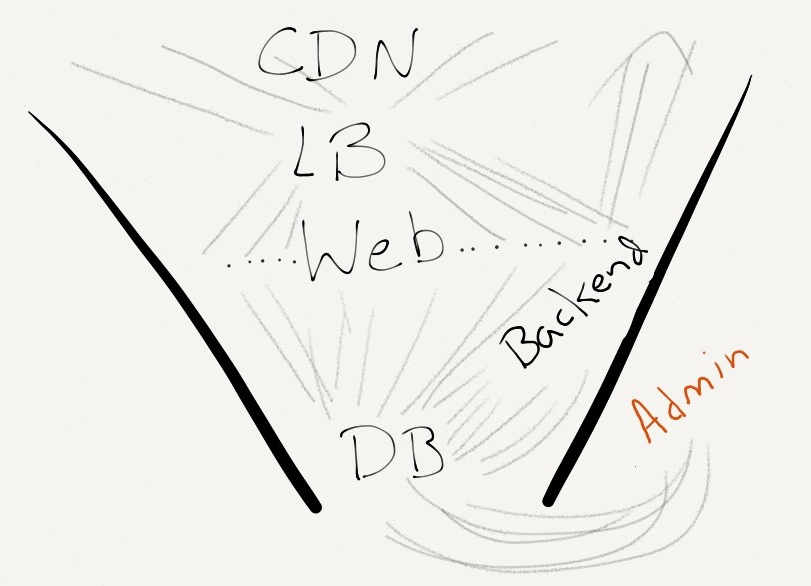

!SLIDE center

# in the trenches

!SLIDE center
# the battlefield

.notes product, bad actors, success, old data, old code, our position: keep things going!

!SLIDE center
# DBA

.notes who here is a "dba"?

!SLIDE center
# this is most every web app

.notes tendency toward disorder, ends up in the DB

!SLIDE
# find a rock (something to push uphill)
.notes dumbest method possible, show processlist
.notes do AB on "web app" loading things, like a count of comments, from active users, show "out of
connections errors"

!SLIDE
# push the rock
.notes add caching, run test again
.notes WHAT?!

!SLIDE
# quit running this query, cache it!
.notes how do we prevent stuff from coming downhill?

!SLIDE center

!SLIDE
# will work for MySQL?

!SLIDE 
# [drasch](http://twitter.com/drasch)

- iContact
-- from 2 to 300 employees
-- from 100k emails per day over to 75 million
- Reverbnation
-- 2 million artists

!SLIDE smbullets
### Photo credits
- [saadandalib](http://www.flickr.com/photos/saadandalib/6954076459/)
- [photofarmer](http://www.flickr.com/photos/photofarmer/7949872568/)
- [exalted](http://www.flickr.com/photos/exalted/137720685/)
- [spicuzza](http://www.flickr.com/photos/spicuzza/4661202721/)
